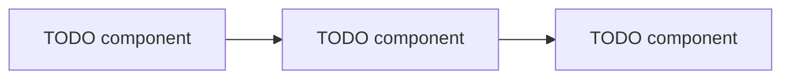
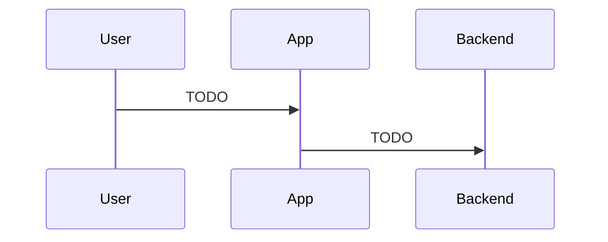
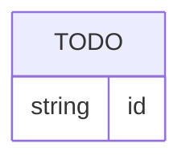

# Architecture

> ⚠️ TODO: Diagram-first "what connects to what and why". Keep each diagram small
> enough to read — split into several rather than cramming one.

## System landscape

⚠️ TODO

## Request / auth flow

⚠️ TODO: Include an auth sequence diagram ONLY if auth exists — otherwise omit it.

## Data layer

⚠️ TODO: Grouped, not exhaustive.

## External integrations

⚠️ TODO

| Integration | Required / optional | Notes |
| --- | --- | --- |
| ⚠️ TODO | ⚠️ TODO | ⚠️ TODO |

## Tech stack

⚠️ TODO

## Glossary

⚠️ TODO
