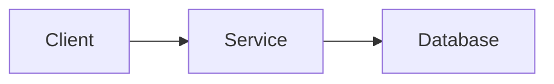

# <Project Name>

> ⚠️ TODO: Replace this paragraph with a one-paragraph description of what the
> project is and who it is for. Keep it plain — a newcomer should understand it.

## Key features

- ⚠️ TODO: Feature one
- ⚠️ TODO: Feature two
- ⚠️ TODO: Feature three

## Tech stack

⚠️ TODO: Fill in the real stack from `package.json` / `requirements.txt` / `go.mod`, etc.

| Layer | Technology |
| --- | --- |
| ⚠️ TODO | ⚠️ TODO |
| ⚠️ TODO | ⚠️ TODO |

## Architecture at a glance



⚠️ TODO: Replace with a diagram that reflects the real system.

## Quick start

```bash
# ⚠️ TODO: Replace with the project's real commands
git clone <your-repo-url>
cd <your-project>
npm install
npm run dev
```

## Further reading

- [User Guide](./USER_GUIDE.md) — how to use the project, no code required.
- [Developer Guide](./DEVELOPER_GUIDE.md) — setup, architecture, and contribution details.
- [Architecture](./ARCHITECTURE.md) — diagram-first overview of how the system fits together.
- [Changelog](./CHANGELOG_TEMPLATE.md) — keep a record of releases (blank template).
